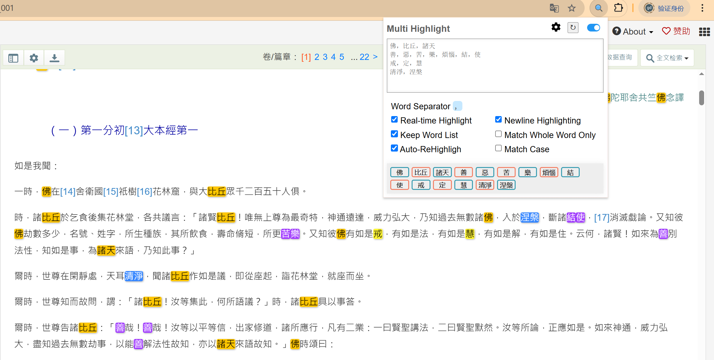

# 资料汇编工作方法

## 一、指导思想
在建构一门禅法课程的过程中，系统性、深度与传承性是关键。禅学作为文明的精神瑰宝，其内涵既深邃广博，又因历史流变、宗派分野和诠释视角的差异而呈现多元样态。若缺乏对经典文献、历代注疏及当代研究的全面梳理，课程设计极易陷入零散、片面或主观臆断的困境。因此，在课程建构之前展开资料汇编工作，并非简单的文献堆砌，而是一次对禅法思想脉络的溯源、对核心义理的提炼，以及对实践智慧的整合。

本汇编以"立足原典、主题检索、广泛包含"为原则，力求将散见于浩瀚文献中的禅法精粹凝练为可参可学的教学资源。初步资料汇编工作主要在传统经典中开展，进一步也将纳入心理学、神经科学等跨学科视角下的现代研究，以期在古今中西的对话中，为禅法课程的体系化、科学化与生活化奠定扎实基础。

## 二、汇编阶段

对一门课程的资料汇编工作，大体上分为两个阶段：课程建构前、课程建构后、常态化迭代阶段。

**1、课程构建之前的阶段**

在课程建构之前，依照课程的主题方向，进行广泛地检索，既要包括主题的内涵，又要涉及主题的外延，既要包含课程的前置内容，又要包含课程的后继内容，既要包含横向的对比，又要包含纵向的深化，围绕主题进行全方位的检索，尽可能地将主题相关的内容都收罗起来，用于课程的系统性建构。

**2、课程构建之后的阶段**

在课程建构之后，因为已经有了第一版的课程系统结构，而建构出来的课程无疑将为课程的进一步建构完善提供更为精准的支撑，所以要将课程的体系结构融入新一轮的资料汇编工作中。新一轮的资料汇编工作应体现课程结构，并对课程结构进行验证。具体包括：

第一，课程结构的验证考量（内涵）。因为是验证工作，所以需要针对课程体系中的关键内容模块，指定主题，定向搜集，进一步丰富课程框架的的原始资料支撑。

第二，课程结构的开放拓展（外延）。由于资料汇编工作是课程建构的基础，所以对于某一内容模块，课程中提到的要收集，课程中没有提到的也要收集。至于多搜索出来的部分的取舍，则留待下一次资料汇编时再做定夺。据此思路，拓展的内容可能有两种：（1）涵盖在课程结构中，但是并未被细目覆盖，此内容收集到对应模块的“其他”条目中；（2）未被课程结构覆盖，但是又与课程主题相关，此内容收集到摘录文本最后，按照关键字分类。

**3、常态化迭代阶段**

课程建构完毕后，每年或每隔一定时期，随着课程建构的不断深入，要相应地进行后续的资料汇编工作，为课程的进一步完善夯实资料基础。

## 三、资料摘录的方法

资料的摘录方法有关键字检索法、通读法、策略组合法等。

**1、关键字检索法**

关键字检索法，可用于快速提取某个主题下的核心文献资料。工作步骤为：

第一步，围绕主题，设置若干关键字。关键字需要尽可能地全面，包括同义词，要尽可能地包含，尽可能减少遗漏。

第二步，关键字检索定位，配合审读取舍。借助工具，通过关键字检索，迅速定位到相关的内容；阅读相关段落内容，必要时参考上下文，决定是否摘录、摘录多少。

摘录的时候尽量摘录一个必要的意义阐述单元，既要保证语义的相对完整性，又要避免过量摘录带来的繁杂无要。

**2、通读法**

通读法，通过系统地阅读，基于对文献的系统把握的基础上，进行摘录，比关键字检索法要深入。工作步骤为：

第一步，分层阅读。可以先速读：浏览目录、章节首尾句，标记潜在重点章节；再精读：对标记部分逐段分析，摘录符合汇编原则的内容。

第二步，在通读的基础上，基于对整体的理解，发现文献中的系统结构、理路、脉络，围绕课程主题，选摘相关的内容。

通读法的好处是可以有更深入的理解，发现隐含线索，缺点是可能比较耗时，也会受到摘录者个人的经验的影响。

**3、策略组合法**

可以结合关键检索法和通读法，在全局关键字检索的基础上，根据需要进行局部的通读，既照顾摘录的效率，又考虑一定的内容理解深度。

## 四、辅助工具

**1、佛典的摘录网站**

CBETA Online电子佛典：[https://cbetaonline.cn](https://cbetaonline.cn)

**2、关键字检索插件**

网站页面的关键字检索，可以直接按“Ctrl+F”进行检索，但是如果关键字较多，一个一个关键字进行验证就比较麻烦。可以借助浏览器插件进行多关键字检索和高亮显示。

比如google的Chrome浏览器有个扩展插件“[Multi Highlight](https://chromewebstore.google.com/detail/multi-highlight/ghinpogonpmlphfkmnjfapdaoaainejn)”，可以同时高亮显示当前页面的多个关键字，而且关键字可以分组，每一组显示不同的颜色，大大方便摘录。

## 五、摘录内容的组织方式

对于课程建构之前，可以按照关键字分类法，每个关键字下包含多种文献中的摘录内容，如：

　　　　　　　　　┌文献１：片段1，片段2，片段3……
　　　　┌关键字１┼文献２：片段1，片段2，片段3……
　　　　│　　　　└文献３：片段1，片段2，片段3……
　　　　│　　　　┌文献１：片段1，片段2，片段3……
目录组织┼关键字２┼文献２：片段1，片段2，片段3……
　　　　│　　　　└文献３：片段1，片段2，片段3……
　　　　│　　　　┌文献１：片段1，片段2，片段3……
　　　　└关键字３┼文献２：片段1，片段2，片段3……
　　　　　　　　　└文献３：片段1，片段2，片段3……

对于课程建构之后，可以按照课程结构进行组织，每个模块下放相关的摘录内容，如：

　　　　　　　　　　　　┌文献１：片段1，片段2，片段3……
　　　　　　　　┌第一节┼文献２：片段1，片段2，片段3……
　　　　　　　　│　　　└文献３：片段1，片段2，片段3……
　　　　　　　　│　　　┌文献１：片段1，片段2，片段3……
　　　　┌第一章┼第二节┼文献２：片段1，片段2，片段3……
　　　　│　　　│　　　└文献３：片段1，片段2，片段3……
　　　　│　　　│　　　┌文献１：片段1，片段2，片段3……
　　　　│　　　└第三节┼文献２：片段1，片段2，片段3……
　　　　│　　　　　　　└文献３：片段1，片段2，片段3……
　　　　│　　　　　　　┌文献１：片段1，片段2，片段3……
　　　　│　　　┌第一节┼文献２：片段1，片段2，片段3……
　　　　│　　　│　　　└文献３：片段1，片段2，片段3……
　　　　│　　　│　　　┌文献１：片段1，片段2，片段3……
目录组织┼第二章┼第二节┼文献２：片段1，片段2，片段3……
　　　　│　　　│　　　└文献３：片段1，片段2，片段3……
　　　　│　　　│　　　┌文献１：片段1，片段2，片段3……
　　　　│　　　└第三节┼文献２：片段1，片段2，片段3……
　　　　│　　　　　　　└文献３：片段1，片段2，片段3……
　　　　│　　　　　　　┌文献１：片段1，片段2，片段3……
　　　　│　　　┌第一节┼文献２：片段1，片段2，片段3……
　　　　│　　　│　　　└文献３：片段1，片段2，片段3……
　　　　│　　　│　　　┌文献１：片段1，片段2，片段3……
　　　　└第三章┼第二节┼文献２：片段1，片段2，片段3……
　　　　　　　　│　　　└文献３：片段1，片段2，片段3……
　　　　　　　　│　　　┌文献１：片段1，片段2，片段3……
　　　　　　　　└第三节┼文献２：片段1，片段2，片段3……
　　　　　　　　　　　　└文献３：片段1，片段2，片段3……

以上为念住课程的资料汇编工作方法。